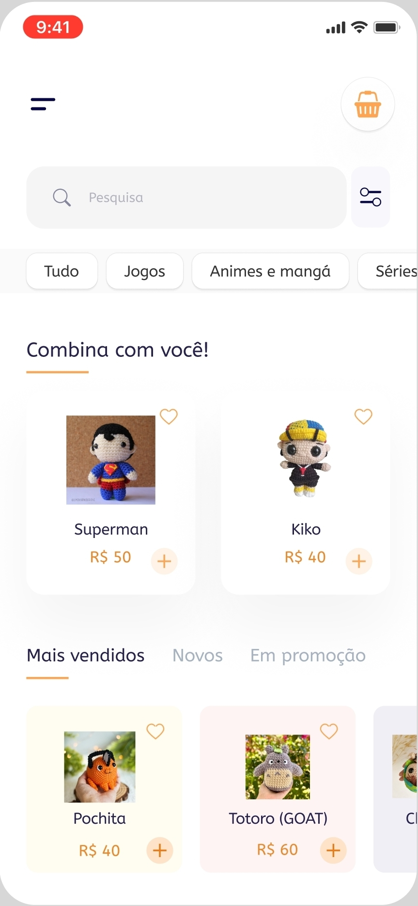

# Sobre a Disciplina
Projeto da disciplina de web mobile da Universidade Presbiteriana Mackenzie
Nessa disciplina, iremos desenvolver uma aplicação web mobile com propósito extensionista

## Integrantes:
- Diego Oliveira Aluizio
- Jonatas Garcia de Oliveira
- Lucas Hiroyuki Omine
- Sabrina Miyasaki

# Ideia do Projeto
Construir uma plataforma de e-commerce para a compra de crochetaria de uma artesã idependente. 
Link do perfil no Instagram: https://www.instagram.com/lihscrochet?igsh=b2piazd4aWthNDg3
Livia Alabarse é uma artista que faz crochet e quer desenvolver um negócio, para isso ela já criou um perfil no Instagram, porém seria interessante que ela tivesse uma plataforma online para realizar vendas de forma profissional

# Explicação
O usuário vai acessar uma página de e-commerce que contém todos os produtos da página lih's crochet 
O site possui um header, onde será exibida uma animação com vários produtos 
No decorrer da página haverão diversos cards com produtos, indicando preço e disponibilidade
Haverá uma seção de produtos especiais: mais vendidos e promoções
Haverão outras páginas, uma de pagamento, uma exibindo o produto

Link Figma: https://www.figma.com/design/OvY61hpPb7LuyCo9ybfxcY/Mobile-and-Web-Interaction--Community-?node-id=4-0&t=dv1LzjVfYkdLwztD-1

# Tutorial
Após a mudança para o NextJS, a maneira para executar a aplicação utilizando um localhost mudou. Agora, em vez de executar o arquivo index.html, será necessário o uso do terminal para execução de todas as dependências do Next juntamente da aplicação. A fim de facilitar os testes, segue uma explicação de como executar corretamente a versão após a mudança:

## Passo 1: Estar no diretório correto
Para correta execução da aplicação, é necessário estar no diretório onde as dependências do NextJS e a aplicação estejam localizados. Para isso, utilize o comando "cd (quaisquer_caminhos_anteriores/)mack-web-nextjs/lihs_crochet/" no terminal.

* Atenção: a parte "(quaisquer_caminhos_anteriores/)" no comando se trata de uma generalização e vai variar de acordo com a máquina e onde os arquivos estão nela. Caso não esteja conseguindo, verifique o caminho até que ele corresponda ao diretório correto.

## Passo 2 (Apenas uma vez): Instalar o Next
Os arquivos necessários para a instalação já estão no projeto. Para realizar a instalação, basta executar o comando "npm install" no diretório descrito no passo anterior. Uma vez instalado, caso deseje executar a aplicação novamente, não será necessário repetir esse passo.

## Passo 3: Rodar!
Com o Next instalado e o terminal no diretório correto, basta utilizar o comando "npm run dev". Após a execução do comando, uma mensagem solicitando a abertura de um navegador deve aparecer. Abra o navegador e pronto! A aplicação está rodando em sua máquina.

## Passo 4: Parando
Para parar a execução da aplicação, basta utilizar um ctrl+c no terminal e ele é encerrado.
---
## Explicação do código

## Carrossel 

## Rota dinâmica
  Foi criado uma nova página onde será exibido o produto que foi clicado.
  
 colocar imagem com a tag Link

  
 Tirar um print das pastas

## Fetch
